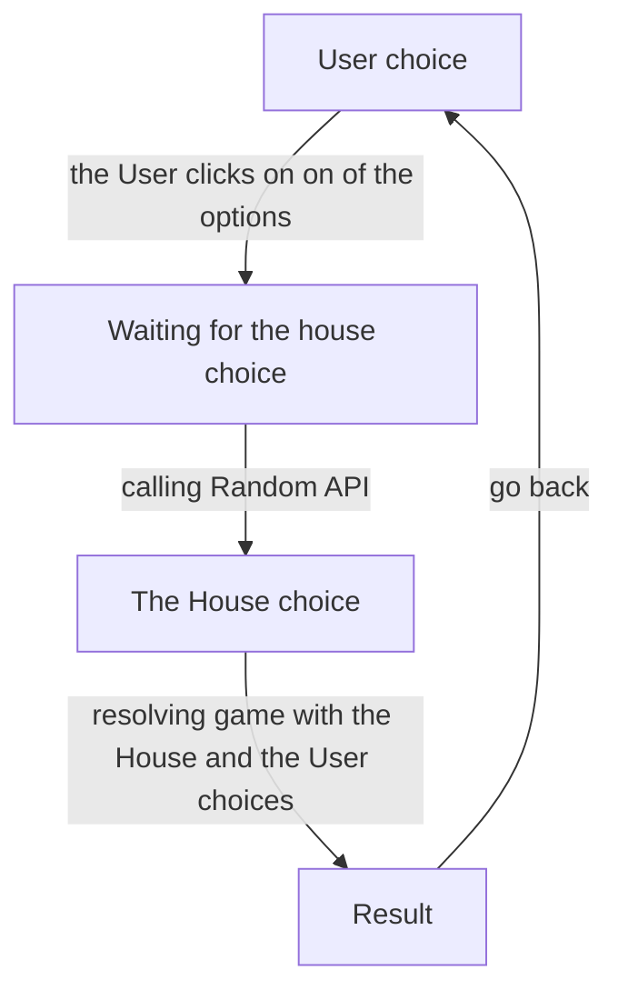

# ROCK PAPER SCISSORS

## Project information

This app enables user to play rock-paper-scissors game with a computer.

The idea of the project was brought by [the frontend mentor challenge](https://www.frontendmentor.io/challenges/rock-paper-scissors-game-pTgwgvgH).

## Motivation

For fun and new expierience.

During development I tried/improved my skills in:

 - tailwind 
 - zustand
 - storybook
 - vite 
 - vitest
 - React Composition API
 - mermaid


## Installation

### Requirements

- node v16.13.2
- yarn 

### Run development server

1. Install packages
```
  yarn
```

2. Run server locally
```
  yarn
```

### Run production build locally

1. Install packages:
```
  yarn
```

2. Make build
```
  yarn build
```

3. Run the production app locally
```
yarn preview
```

## Game flow


